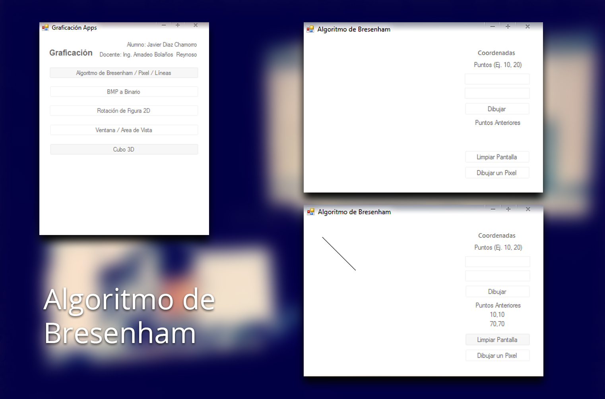
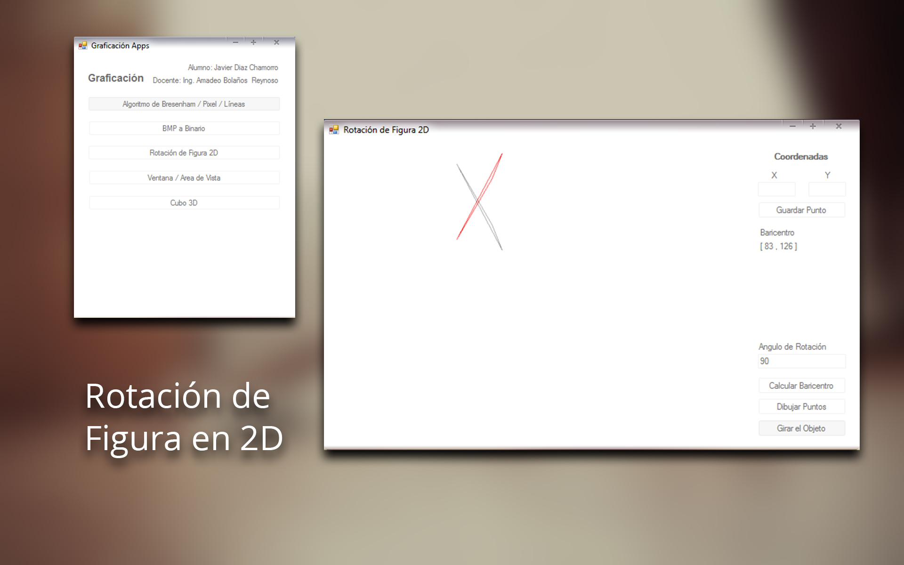
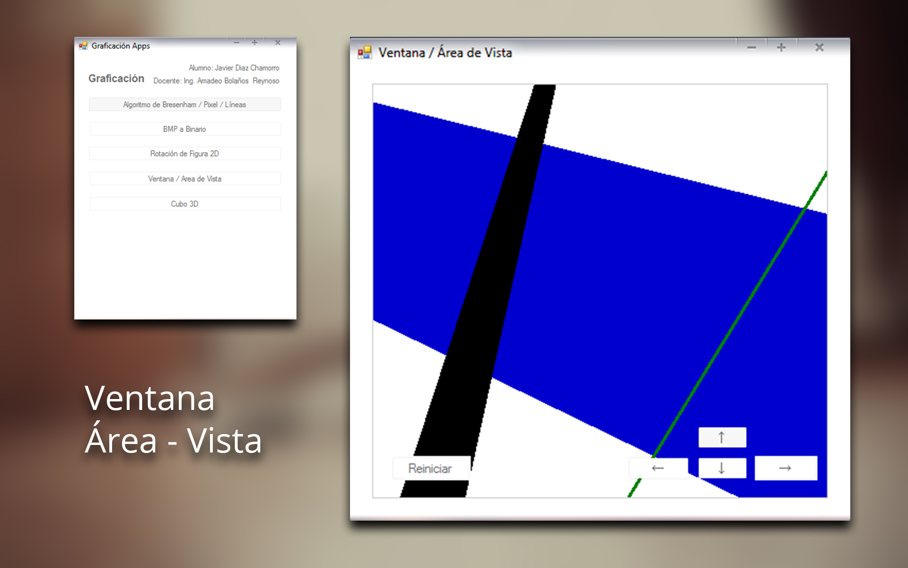
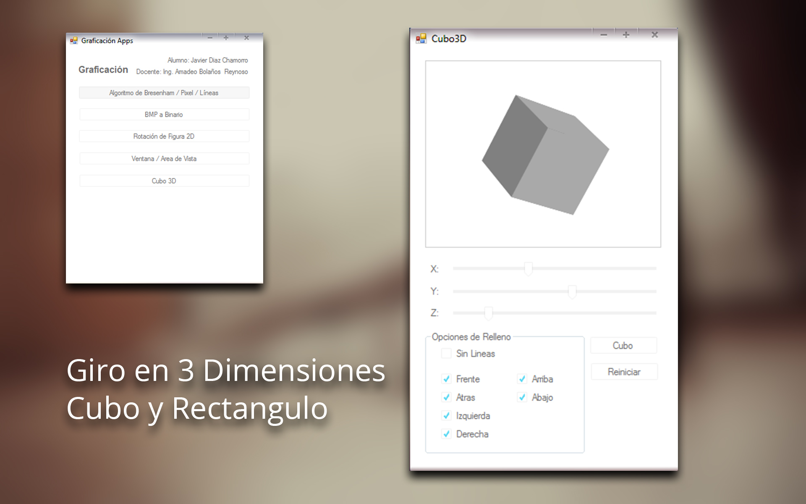
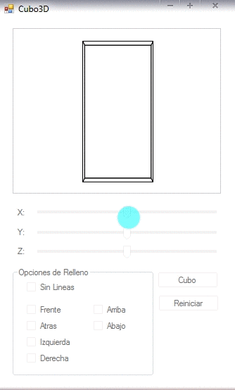

## Desarrollo de Aplicaciones

**Autor:** Javier Diaz Chamorro
######Instituto Tecnológico de Lázaro Cárdenas
######Ingeniería en Sistemas Computacionales

_ _ _

#####Aplicaciones de Graficación


- - -

######Algoritmo de Bresenham
Es un algoritmo preciso para la generación de líneas de rastreo que convierte mediante rastreo las líneas al utilizar solo cálculos incrementals con enteros que se puedan adaptar para desplegar circunferencias y curvas. Los ejes verticales muestran las posiciones de rastreo y los ejes horizontales identifican columnas de pixel.



- **Aplicación:** Algoritmo de Bresenham
- **IDE:** Visual Studio 2013
- **Versión:** 1.2
- **Lenguaje:** C#

_ _ _

######Imagen BMP a Archivo Binario .bin
Esta aplicación realiza la conversión de un archivo en Mapa de Bits (BMP) y lo decodifica en formato Hexadecimal en un archivo .bin, en el cuál se pueden visualizar por pixel cada color que se encuentra en la imagen convertida.

```
Nota: El archivo .bin se almacena en el directorio D:\ si no cuentas con esta ruta, modificar el programa y asignarle un ruta con privilegios de modificación.
```


- **Aplicación:** Archivos BMP a Binarios
- **IDE:** Visual Studio 2013
- **Versión:** 2.0
- **Lenguaje:** C#

_ _ _

######Rotación de Figura en 2D
Esta aplicación traza una figura con 3 puntos que se le son ingresados en el panel de puntos, para posteriomente generar su Baricentro en el cuál girará según los grados que el usuario le indique. Con lo cuál la aplicación generara una figura trazada ya con su respectiva rotación en otro color.

######Instrucciones de Uso

1. Agregar 3 puntos definidos como [X , Y] en la parte de agregar coordenadas
2. Una vez agregados, Dibujar la figura presionando el botón.
3. Calcular el Baricentro presionando el botón.
4. Agregar el ángulo de giro.
5. Finalmente, Girar la Figura.



- **Aplicación:** Rotación de Figura en 2D
- **IDE:** Visual Studio 2013
- **Versión:** 1.0
- **Lenguaje:** C#

- - -

######Ventana Area de Vista
La ventana son las coordenadas plasmadas en un universo o mundo real, mientras que el puerto de Vista realiza las transformaciones de las coordenadas del objeto en un mundo real hacia las coordenadas de la vista que se esta utilizando.



- **Aplicación:** Ventana Area de Vista
- **IDE:** Visual Studio 2013
- **Versión:** 2.0
- **Lenguaje:** C#


- - -

######Giro en 3 Dimensiones (Cubo)
Fue elaborado en base a la creación de puntos X, Y, Z los cuales son reposicionados a través de la clase Point3D en la cual se realizan todas las tranformaciones 3D desde los puntos dimensionales y utilizando los puntos preestablecidos por C#.



######Demostración


- **Aplicación:** Cubo 3D - Rotación de Euler
- **IDE:** Visual Studio 2013
- **Versión:** 3.0
- **Lenguaje:** C#